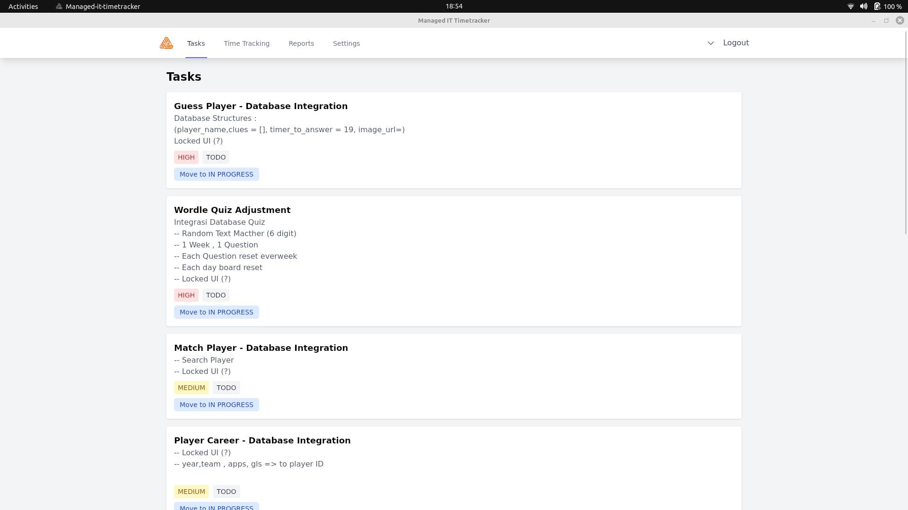

# TimeTracker for Managed IT

Track your time spent on tasks efficiently with the Managed IT TimeTracker desktop application.



## Features

- Track time for tasks with start/stop functionality
- View detailed reports of time entries
- Minimize to system tray
- Offline-first with secure API synchronization
- Cross-platform support (Windows & Linux)

## Development Setup

### Prerequisites

- Node.js 18+
- Rust toolchain (latest stable)
- For Linux:
```bash
sudo apt update
sudo apt install libwebkit2gtk-4.0-dev \
    build-essential \
    curl \
    wget \
    file \
    libssl-dev \
    libgtk-3-dev \
    libayatana-appindicator3-dev \
    librsvg2-dev \
    libsoup-3.0
```

### Installation

1. Clone the repository:
```bash
git clone https://github.com/cds-id/managed-it-timetracker
cd managed-it-timetracker
```

2. Install dependencies:
```bash
npm install
```

3. Run in development mode:
```bash
npm run tauri dev
```

### Building

For production build:
```bash
npm run tauri build
```

The output will be in:
- Windows: `src-tauri/target/release/bundle/msi/`
- Linux: `src-tauri/target/release/bundle/deb/`

## Configuration

1. On first launch, configure your API endpoint
2. Enter your API token
3. The app will validate the connection and save the configuration

## Contributing

1. Fork the repository
2. Create your feature branch (`git checkout -b feature/AmazingFeature`)
3. Commit your changes (`git commit -m 'Add some AmazingFeature'`)
4. Push to the branch (`git push origin feature/AmazingFeature`)
5. Open a Pull Request
